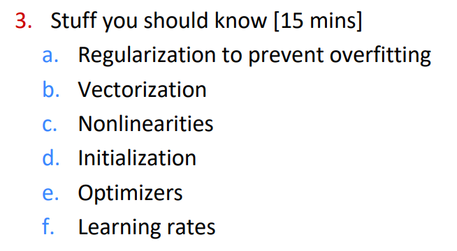
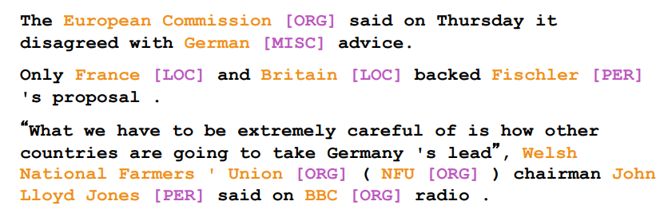
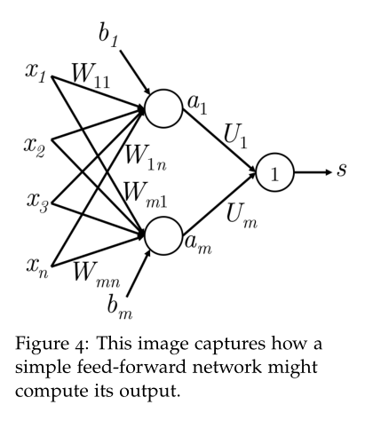
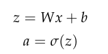
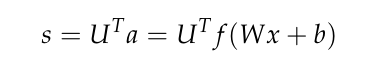

# (二) NER 【cs224n 小白易懂学习笔记】

课程地址：https://web.stanford.edu/class/archive/cs/cs224n/cs224n.1194/

参考课程：Lecture3, Lecture4

预备知识：矩阵运算，链式法则求导，神经网络

建议：

1. 把相关课程视频看完
2. 回顾神经网络知识
3. 点个赞

---

## 1. 本章课程内容总结

### 1.1 神经网络

两节课主要讲解了关于神经网络的前向传播，反向传播以及矩阵计算等等，相关内容有非常多的资料笔记，本人学习的是[吴恩达深度学习课程第一课 — 神经网络与深度学习](https://www.bilibili.com/video/BV164411m79z?from=search&seid=10933202685956438005)

### 1.2 神经网络的优化算法

在lecture4的最后提到了相关优化算法，如正则化，Adam等等，相关课程可见[吴恩达深度学习课程第二课 — 改善深层神经网络：超参数调试、正则化以及优化](https://www.bilibili.com/video/BV1V441127zE)



### 1.3 前向传播\命名实体识别（NER）

**本章根据笔记**[note(lectures 3 and 4)](https://web.stanford.edu/class/archive/cs/cs224n/cs224n.1194/readings/cs224n-2019-notes03-neuralnets.pdf)


## 2. 前向传播\命名实体识别（NER）

* NLP 当中有一类问题就叫做命名实体识别```named-entity recognition```



​	找到并给每个名字分好类，如France 是一个位置```[LOC]```

---


​	**例子：“Museums in Paris are amazing”**

* 我们需要辨别中心词“Paris”是否为命名实体
  * 根据Paris是否存在在句子中，纯根据词向量是很难进行辨别的
  * 我们需要根据Paris与上下文的联系来进行判别
  * **训练结果**： 如果第一个单词是类似“Museums”, 第二个单词是“in” , 那么第三个单词即中心词应该被判断为**位置**【LOC】

* 我们采用如下结构，即一层隐含层：

  

  其中激活函数为```sigmoid```

  

  然后我们需要给这个结果计算一个得分，所以需要乘上一个矩阵U

  

  这个时候我们知道：

  1、输入的是一个句子, 内含五个词向量，如果每个词向量是四维的话，那么此时输入的x的维度是：
  $$
  x \in \mathbb{R}^{20 \times 1}
  $$
  ​	如果我们输入两个句子则是：
  $$
  x \in \mathbb{R}^{20 \times 2}
  $$
  2、我们省略中间的权重，最后的输出是一个1x1的向量s, 也是我们预测出来“中心词为位置的分数”

* 最大间隔目标函数

  * 我们知道，神经网络需要一个优化目标函数。在这里，我们使用的是最大化间隔，即把真的（也就是中心词是位置的）得分远远大于假的，假的句子如“Not all museums in Paris”, 这里我们把这种假标签记为 **s_c**

  * 接下来我们就要对目标函数进行最大化，即最大化（s - s_c）

  * 首先一种简单的做法，就是使“正确”数据的得分比“错误”数据要高即可，也就是 s - s_c > 0 就满足我们的要求，这个时候我们可以得出目标函数：
    $$
    minimize J = max(s_c - s, 0)
    $$

  * 然⽽，上⾯的优化⽬标函数是有⻛险的，因为它不能创造⼀个安全的间隔。我们希望“真”数据要⽐“假”数据的得分⼤于某个正的间隔 。换⽽⾔之，我们想要误差在 就开始计算，⽽不是当时就计算。因此，我们修改优化⽬标函数为：
    $$
    minimize J = max(\bigtriangleup + s_c - s, 0)
    $$

  * 我们可以把这个间隔缩放使得 ，让其他参数在优化过程中⾃动进⾏调整，并且不会影响模型的表现。如果想更多地了解这⽅⾯，可以去读⼀下 中的函数间隔和⼏何间隔中的相关内容。最后，我们定义在所有训练窗⼝上的优化⽬标函数为：
    $$
    minimize J = max(1 + s_c - s, 0)
    $$

* 之后就是反向传播啦

## 3. 参考资料

1. [CS224n-2019 笔记列表](https://zhuanlan.zhihu.com/p/68502016)

